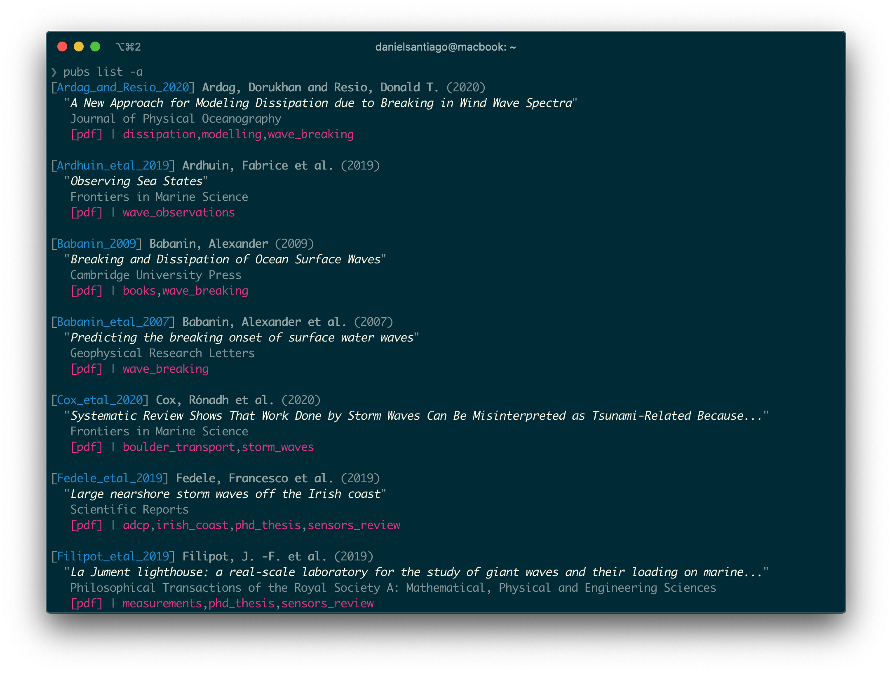

# Pubs

Pubs brings your bibliography to the command line.

Pubs organizes your scientific papers together with their bibliographic data and provides command line access to basic and advanced manipulation of your library.

Pubs is built with the following principles in mind:

 - all papers are referenced using unique citation keys,
 - bibliographic data—bibtex information—is kept separated from metadata such as links to pdf or tags.
 - everything is stored in plain text so it can be manually edited or version controlled.

Pubs is currently being maintained, rather than developed aggressively. We add small features,
correct bugs, but have no short-term plans to add major features to it. Pubs does most of what it
is supposed to do: help us do science, so now we are mostly doing that.

**Notice:** pubs is relatively stable but comes with no warranty; do keep backups of your data.
**Notice:** pubs currently works with Python 2.7, but support will be dropped as soon as maintaining it becomes tedious.

## Comments on this fork

I adapted this fork for my personal use. The only change with regard the original
is the way the items are displayed on the screen, here a screenshot:




## Installation

You can install the latest stable version of `pubs` through Pypi, with:
  ```
  pip install pubs
  ```

Alternatively, you can:

  - install the latest development version with pip:
    ```
    pip install --upgrade git+https://github.com/pubs/pubs
    ```

  - clone the repository and install it manually:
    ```
    git clone https://github.com/pubs/pubs
    cd pubs
    python setup.py install [--user]
    ```

Arch Linux users can also use the [pubs-git](https://aur.archlinux.org/packages/pubs-git/) AUR package.


## Getting started

Create your library (by default, goes to `~/.pubs/`).
  ```
  pubs init
  ```

Import existing data from bibtex (pubs will try to automatically copy documents defined as 'file' in bibtex):
  ```
  pubs import path/to/collection.bib
  ```

or for a .bib file containing a single reference:
  ```
  pubs add reference.bib -d article.pdf
  ```

pubs can also automatically retrieve the bibtex from a doi:
  ```
  pubs add -D 10.1007/s00422-012-0514-6 -d article.pdf
  ```

or an ISBN (dashes are ignored):
  ```
  pubs add -I 978-0822324669 -d article.pdf
  ```

or an arXiv id (automatically downloading arXiv article is in the works):
  ```
  pubs add -X math/9501234 -d article.pdf
  ```


## References always up-to-date

If you use latex, you can automatize references, by running `pubs export > references.bib` each time you update your library, which also fits well as a `makefile` rule.

This ensures that your reference file is always up-to-date; you can cite a paper in your manuscript a soon as you add it in pubs. This means that if you have, for instance, a DOI on a webpage, you only need to do:
  ```
  pubs add -D 10.1007/s00422-012-0514-6
  ```

and then add `\cite{Loeb_2012}` in your manuscript. After exporting the bibliography, the citation will correctly appear in your compiled pdf.


## Document management

You can attach a document to a reference:
  ```
  pubs doc add Loeb2012_downloaded.pdf Loeb_2012
  ```

And open your documents automatically from the command line:
  ```
  pubs doc open Loeb_2012
  pubs doc open --with lp Loeb_2012  # Opens the document with `lp` to actually print it.
  ```


## Versioning

Pubs comes with a git plugin that automatically commits your changes. You only need to activate it in your configuration:
  ```ini
  [plugins]
  active = git,
  ```

You can then also conveniently interact with the git repository by using `pubs git <regular git commands>`.


## Multiple pubs Repositories

You may want to have different pubs repositories, for different projects. To create an alternate repository:
  ```
  pubs --config /path/to/config init --pubsdir /path/to/desired_repository_directory
  ```
The configuration file and repository will be automatically created.

Then you can add papers to the new repository:
  ```
  pubs --config /path/to/config add -D 10.1007/s00422-012-0514-6
  ```

A useful thing might be to define an alias in your shell:
  ```
  alias pubs2="pubs --config /path/to/config"
  ```
and then use `pubs2` as you would use `pubs` directly.  Note that you cannot use the alias plugin below to do this.


## Customization

Pubs is designed to interact well with your command line tool chain.
You can add custom commands to pubs by defining aliases in your configuration file (make sure that the alias plugin is activated in your configuration by using `pubs conf`).
  ```ini
  [[alias]]
  evince = open --with evince
  count = !pubs list -k "$@" | wc -l
  ```

The first command defines a new subcommand: `pubs open --with evince` will be executed when `pubs evince` is typed.
The second starts with a bang: `!`, and is treated as a shell command. If other arguments are provided they are passed to the shell command as in a script. In the example above the `count` alias can take arguments that are be passed to the `pubs list -k` command, hence enabling filters like `pubs count year:2012`.


## Autocompletion

For autocompletion to work, you need the [argcomplete](https://argcomplete.readthedocs.io) Python package, and Bash 4.2 or newer. For activating *bash* or *tsch* completion, consult the [argcomplete documentation](https://argcomplete.readthedocs.io/en/latest/#global-completion).

For *zsh* completion, the global activation is not supported but bash completion compatibility can be used for pubs. For that, add the following to your `.zshrc`:
  ```shell
  # Enable and load bashcompinit
  autoload -Uz compinit bashcompinit
  compinit
  bashcompinit
  # Argcomplete explicit registration for pubs
  eval "$(register-python-argcomplete pubs)"
  ```

## Need more help ?

You can access the self-documented configuration by using `pubs conf`, and all the commands' help is available with the `--help` option. Did not find an answer to your question? Drop us an issue. We may not answer right away (science comes first!) but we'll eventually look into it.


## Authors

### Creators

- [Fabien Benureau](http://fabien.benureau.com)
- [Olivier Mangin](http://olivier.mangin.com)


### Contributors

- [Jonathan Grizou](https://github.com/jgrizou)
- [Arnold Sykosch](https://github.com/73)
- [Tyler Earnest](https://github.com/tmearnest)
- [Dennis Wilson](https://github.com/d9w)
- [Bill Flynn](https://github.com/wflynny)
- [Kyle Sunden](https://github.com/ksunden)
- [Shane Stone](https://github.com/shanewstone)
- [Amlesh Sivanantham](http://github.com/zamlz)
- [DV Klopfenstein](http://github.com/dvklopfenstein)
